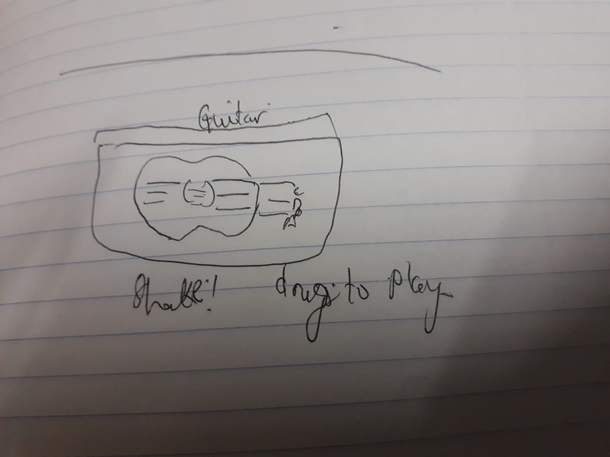
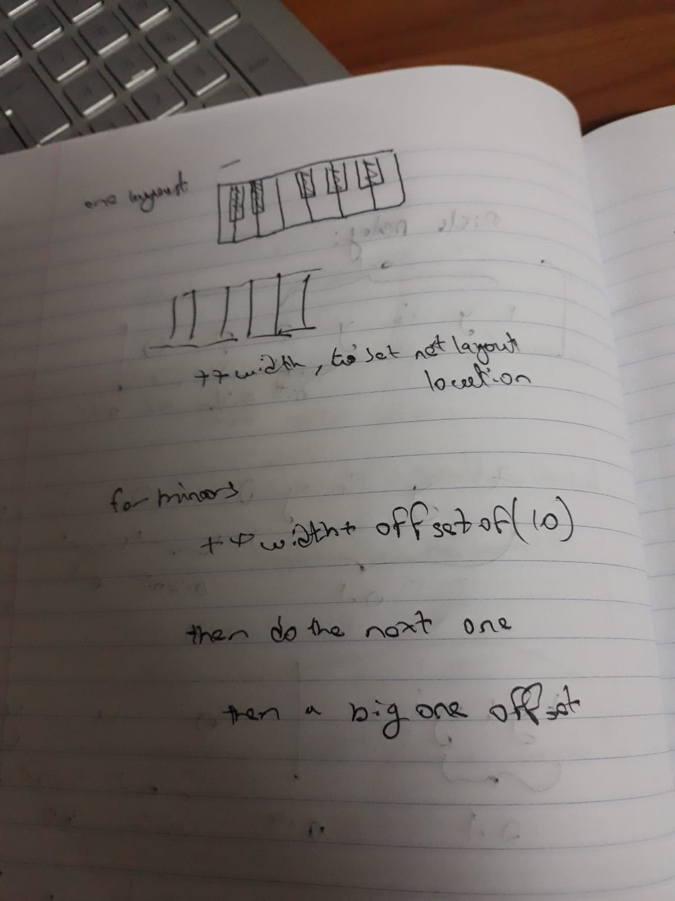

# Sketches Description

Provide a short description that can help someone understand the images you have provided.

>This image down below was my first interpretation of the idea I had in mind. I wanted to make an Instrument Application, but I didnot know what instruments, so I drew couple viable concepts

>Picture Description: This picture shows an app for flute playing, where I user will click on the holes to play a note
----------------------------------------------------------------------------------------------------------------------------------
>My 2nd Attempt at the concept was a Guitar app as seen below. The handling will be by dragging the mouse cursor over to play the different consecutive notes.

-----------------------------------------------------------------------------------------------------------------------------------
> Then I came up with do a Piano app, which sounded more fun. So I drew How it should look like when  the user look at it.

>The image above has the initial concept image I had for the application.
>The image also contains some part of the algorithm I had in mind of how to create the piano via using canvas:
>Where we can see I have the width incrementing everytime a key is added, which I used to postion the next key canvas so they dont overlap

------------------------------------------------------------------------------------------------------------------------------------
For the Piano I have to use Media Player from JAVA API, prior to not knowing how to use it, this image shows some sketches of me trying to setup the layout of the piano and finding a way of assigning the audios to each keys, Which is essentially for each audio, we create a key based on what folder we look at

I used this similar approach in my model class grabbing the audio then setting up the keys for each audio

-------------------------------------------------------------------------------------------------------------------------------------
>This image shows my attempt in trying to figure out how to get the right key selected for my mouse click event, This part was a challenging one to find, especially when we have to tract all keys and see where they are located in the BorderPane center.

>In here it shows me doing Offsets calculation so I can fit to check the bound selections for the mouse event.
>I ended up not need those calculations but in the final app, I do have an offset set up to get the mouse event correctly, [ This did use couple of brain cells to make since I had to find the right bounding box we were in] On top of the difficulty I already had, When selecting the pane since the Piano is a StackPane containing 2 other StatckPane, I had an issue of where I click It would always give my a minorkey as target, That is because my minor key set was at the top.
>So I fixed it by going backwards and getting the parent of its parent, to get the big stackpane which contains the 2 other stackpanes which I used to check for the On Mouse Click Event

---------------------------------------------------------------------------------------------------------------------------------------
>The image shows a lot of messy work, but it sums up the explaination in mme trying to figure out how to set up my Piano without having to draw everything statically, 

>For a Piano notes start from C to B, so As mentioned in my REPORT.MD, This would be one chunk, then I repeat on creating thouse but for the next set of notes
I also have different ideas in how I can set up a left slider menu.

---------------------------------------------------------------------------------------------------------------------------------------
>Image shows some concepts in me trying to make the center up text field pane and how it should be in the Border Pane.

This sketch shows the clear button set up also.

---------------------------------------------------------------------------------------------------------------------------------------
> Sketch shows the concept I had for my theme scene intially, on clicking it changes the background, but this window layout was too much "squary" and didnot look as good in pratice and I ended up doing Rectangular Panes set up which looks really cool [ as shown in my final app ThemeScene ]

